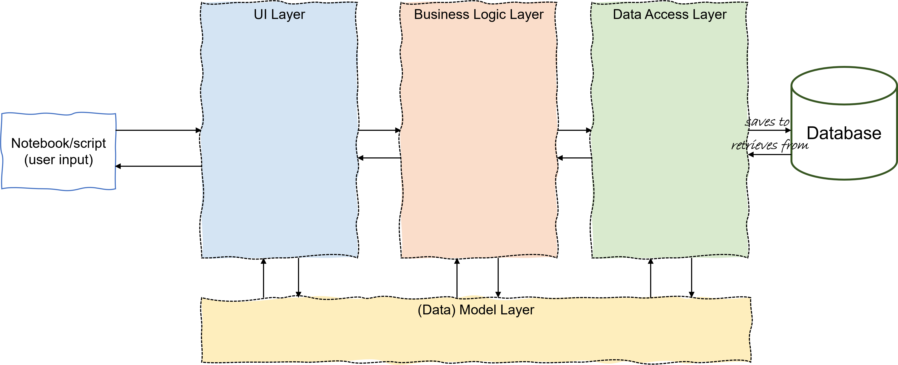

# AEP_Hotelreservierungssystem

### Rollen

Entwickler - Yannick Krähenbühl, Cesco Meggiolaro, Tobias Mutz, Jennifer Studer

Coaches -  Sandro Schwander, Phillip Gachnang

# Projektstruktur, Überblick

In der Datenbank werden sämtliche Daten hinterlegt und gespeichert.
Die [model](model) definieren die Datenstrukturen, die im gesamten Projekt verwendet werden. Ebenfalls werden die model mit Getter und Setter definiert. Der Getter definiert, dass die Daten abgefragt werden können, während der Setter die Eingaben validiert, damit die Fehlerrate in den Daten möglichst minimiert wird.  
Die den Zugriff auf die Datenbank ist der [data_access](data_access) zuständig. Darin wird die Verfügbarkeit der Abfragen mit SQL-Statements gewährleistet, welche in der [business_logic](business_logic) definiert werden. Genauer gessagt verbindet der Business Logic Layer die Datenbankabfragen vom Business Logic Layer mit Regeln und Abläufen.
Das UI (User Interface) wurde in der User Story 1 der Datenvisualisierung festgehalten. Dabei liegt der Fokus auf die benutzerfreundliche Darstellung und kommuniziert mit dem Business Logic Layer, um die aktuellsten Informationen benutzerfreundlich anzuzeigen.

# Klassendiagramm

Das Klassendiagramm dient als Grundlage für die Objektstruktur, Geschäftslogik und Datenpersistenz in Python.
### Guest
Repräsentiert einen registrierten Gast, der eine Buchungen buchen, stornieren und den Buchungsverlauf anzeigen kann.

### Booking
Verbindet die Gästen mit Zimmern zu den bestimmten Zeiträumen, z.B. mit den Attributen check_in_date, check_out_date, is_cancelled, total_amount.
Mögliche Methoden sind die Buchungsdaten zu ändern oder den Zahlungsbetrag zu berechnen.

### Room
Beinhaltet Informationen zu Zimmern in Hotels, welche Listen von RoomType und Facility enthält, die mit der Logik zur Zimmerauswahl verwendet wird. 

### Hotel
Repräsentiert ein Hotel mit Name, Adresse, Sterne und der Zimmerliste.

### Invoice
Wird bei einer Buchung erstellt, berechnet und speichert den Betrag und generiert ein pdf Dokument der Rechnung, welche direkt zum Gast gesendet wird.

### Admin
Der Admin hat Rechte zur Verwaltung der Benutzer, Hotels, Buchungen etc.

### Address
Enthält die Adressen von Guest, Hotel und Admin.

### Facility
Zusatzleistungen im Hotel, z.B. Spa, WLAN, ein Zimmer kann mehrere Facility-Objekte beinhalten.

### RoomType
Definiert die Art des Zimmers (Einelzimmer, Suite, Doppelzimmer) und die maximale Anzahl der Gäste pro Zimmer.

## Beziehungen
Guest -> Booking: 1:n

Ein Gast kann mehere Buchungen tätigen, während im System eine Buchung nur auf einen Gast zugeteilt werden kann.

Booking -> Room: m:n

Buchungen können einen oder mehrere Räume enthalten.

Hotel -> Room: 1:n

Ein Hotel hat ein oder mehrere Räume, während ein Raum genau ein Hotel hat.

Room -> Facility: m:n

Räume können mehrere Einrichtungseigenschaften enthalten.

Booking -> Invoice: 1:n

Eine Buchung kann eine oder mehrere Rechnungen enthalten, eine Rechnung gehört genau zu einer Buchung.

Hotel, Guest -> Address: 1:1

Eine Adresse gehört genau zu einem Gast oder einem Hotel.

Admin -> Hotel, Room, RoomType, Booking: m:n

Ein Admin kann ein oder mehrere Hotels, Räume, Raumtypen oder Buchungen bearbeiten, hinzufügen oder stornieren.

Room -> RoomType: 1:1

Ein Raum hat genau einen Raumtyp, während ein Raumtyp ebenso genau einen Raum betrifft.

# Umsetzung User Stories
Sämtliche UserStory Abfragen werden in einem seperaten Jupyter Notebook ([user_stories.ipynb](user_stories.ipynb)) abgefragt.
Grundsätzlich kann man rückblickend sagen, dass es öfters Probleme bei den Datentypen in den Klassen gab, welche falsch definiert wurden und im nachhinein neu angepasst werden mussten.

### User Story 1; Als Gast möchte ich die verfügbaren Hotels durchsuchen, damit ich dasjenige auswählen kann, welches meinen Wünschen entspricht. Wünsche sind:
### User Story 1.1; Ich möchte alle Hotels in einer Stadt durchsuchen, damit ich das Hotel nach meinem bevorzugten Standort (Stadt) auswählen kann.
Zuerst wird über das HotelManager-Objekt der Zugriff auf die Hoteldatenbank initialisiert: dao = HotelDataAccess("database/hotel_reservation_sample.db"), manager = HotelManager(dao). Es wird gezielt nach Hotels gefiltert, deren Stadtfeld mit "Basel" übereinstimmt. Die Methode show_hotels_by_city() übernimmt diese Filterung intern(z.B.per SQL). Falls keine passenden Hotels existieren, gibt das System eine entsprechende Meldung aus: if not hotels_in_WunschStadt: print("Keine Hotels in dieser Stadt gefunden."). Alle Hotels die in der gewünschten Stadt gefunden wurden, werden mit Name, Straße, PLZ und Stadt angezeigt. Exakt diese Informationen benötigt der Gast für eine erste Auswahl.

### User Story 1.2; Ich möchte alle Hotels in einer Stadt nach der Anzahl der Sterne (z.B. mindestens 4 Sterne) durchsuchen.
Auch hier erfolgt der Zugriff auf die Hoteldaten über den HotelManager. Der Gast wählt die Stadt sowie die gewünschte Mindestanzahl an Sternen: city = "Basel", min_stars = 5. Die Methode kombiniert beide Filterkriterien und gibt nur Hotels zurück, die sowohl in der Stadt liegen als auch die Mindestanzahl an Sternen erfüllen: result = manager.show_hotels_by_city_and_min_stars(city, min_stars). Falls Treffer vorhanden sind, werden Name, Sterneanzahl und Adresse jedes passenden Hotels angezeigt: if result: print(f"Gefundene Hotels in '{city}' mit mindestens {min_stars} Sternen:"), for h in result: print(f" - {h.name} ({h.stars} Sterne) – {h.address.street}, {h.address.zip_code}")

### User Story 1.3; Ich möchte alle Hotels in einer Stadt durchsuchen, die Zimmer haben, die meiner Gästezahl entsprechen (nur 1 Zimmer pro Buchung).
Es werden zwei Datenquellen angebunden: eine für Hotels (HotelDataAccess) und eine für Zimmer (RoomDataAccess). Diese ermöglichen den Zugriff auf die notwendigen Daten für die kombinierte Filterung: dao = HotelDataAccess("database/hotel_reservation_sample.db"), room_dao = RoomDataAccess("database/hotel_reservation_sample.db"), manager = HotelManager(dao, room_dao). Der Gast definiert, in welcher Stadt er suchen möchte und wie viele Personen im Zimmer Platz finden müssen: city = "Zürich", guest_count = 1. Die Methode find_hotels_by_city_and_guests() filtert die Hotels nach Stadt und prüft für jedes Hotel, ob mindestens ein Zimmer vorhanden ist dessen room_type.max_guests den gewünschten Wert erfüllt: result = manager.find_hotels_by_city_and_guests(city, guest_count). Alle passenden Hotels werden mit Name, Straße und Postleitzahl ausgegeben: if result: print(f"Gefundene Hotels in '{city}' mit Zimmern für mindestens {guest_count} Gäste:"), for h in result: print(f"  • {h.name} – {h.address.street}, {h.address.zip_code}"), else: print("Keine passenden Hotels gefunden.") Damit steht Gästen eine präzise und benutzerfreundliche Filterfunktion zur Verfügung, um realistisch buchbare Hotels nach Gästeanzahl zu durchsuchen, Das is ein wichtiger Baustein für das Nutzererlebnis im Buchungsprozess.

### User Story 1.4; Ich möchte alle Hotels in einer Stadt durchsuchen die während meines Aufenthaltes ("von" (check_in_date) und "bis" (check_out_date)) Zimmer zur Verfügung haben,damit ich nur relevante Ergebnisse sehe.

### User Story 1.5; Ich möchte Wünsche kombinieren können, z.B. die verfügbaren Zimmer zusammen mit meiner Gästezahl und der mindest Anzahl Sterne.

### User Story 1.6; Ich möchte die folgenden Information pro Hotel sehen: Name, Adresse, Anzahl der Sterne.

Bei den Usterstories 1 waren vor allem die Importe herausfordernd, was nach einigen Recherchen reibungslos funktionierte. Ebenfalls eine grosse Herausforderung war die Trennung der Business Logic und dem Data Access, also welche Informationen wo hinterlegt werden. 

### User Story 2; Als Gast möchte ich Details zu verschiedenen Zimmertypen (Single, Double, Suite usw.), die in einem Hotel verfügbar sind, sehen, einschliesslich der maximalen Anzahl von Gästen für dieses Zimmer, Beschreibung, Preis und Ausstattung, um eine fundierte Entscheidung zu treffen.
### User Story 2.1; Ich möchte die folgenden Informationen pro Zimmer sehen: Zimmertyp, max. Anzahl der Gäste, Beschreibung, Ausstattung, Preis pro Nacht und Gesamtpreis.
Über die Definition von check_in und check_out kann optional der Gesamtpreis für den Aufenthalt berechnet werden: check_in = date(2025, 7, 11), check_out = date(2025, 7, 15). Alle Zimmerdetails werden über den room_manager geladen: room_infos = room_manager.show_room_details(). Für jedes Zimmer werden folgende Informationen angezeigt: Zimmertyp: room.room_type.description, Maximale Gästezahl: room.room_type.max_guests, Ausstattung: Aus room.facilities extrahiert; falls keine vorhanden ist, wird „Keine!“ ausgegeben, Preis pro Nacht: room.price_per_night in CHF, formatiert auf zwei Nachkommastellen. Wenn Check-In und Check-Out gesetzt sind, wird der Gesamtpreis auf Basis der Nächte berechnet: nächte = (check_out - check_in).days, gesamtpreis = room.price_per_night * nächte. Die Funktion bietet den Gästen eine vollständige und verständliche Übersicht, mit der sie Zimmertypen vergleichen und fundierte Buchungsentscheidungen treffen können.
### User Story 2.2; Ich möchte nur die verfügbaren Zimmer sehen, sofern ich meinen Aufenthalt (von – bis) spezifiziert habe.
Der Gast gibt Check-in und Check-out als Datumsobjekte an: check_in = date(2025, 8, 20), check_out = date(2025, 8, 22). Die Methode "find_available_rooms_by_dates" liefert nur Zimmer zurück, die im gewählten Zeitraum frei sind: verfuegbare_zimmer = room_manager.find_available_rooms_by_dates(check_in_date=check_in, check_out_date=check_out, booking_dao=booking_dao). Es werden ausschließlich freie Zimmer ausgegeben: for room in verfuegbare_zimmer:, Zimmertyp und Zimmernummer:     print(f"Zimmer {room.room_number} – {room.room_type.description}"), Hotelname und Adresse: print(f" Hotel: {room.hotel.name}, Adresse: {room.hotel.address.street}{room.hotel.address.city}"), Maximale Gästeanzahl:   print(f"  Max. Gäste     : {room.room_type.max_guests}"), Ausstattung (oder „Keine“): print(f"  Ausstattung    : {ausstattung if ausstattung else 'Keine'}"), Preis pro Nacht:     print(f"  Preis pro Nacht: {room.price_per_night:.2f} CHF"), Optional: Gesamtpreis (abhängig von Aufenthaltsdauer): if check_in and check_out and check_out > check_in: nächte = (check_out - check_in).days, gesamtpreis = room.price_per_night * nächte, print(f"  Gesamtpreis    : {gesamtpreis:.2f} CHF für {nächte} Nächte"). Die Funktion sorgt für eine realistische, zielgerichtete Anzeige und verbessert so die Benutzerfreundlichkeit beim Buchen deutlich.
Die Herausforderung dieser Userstory war die Verknüpfung von room, room_type, booking mit den check_in_date und check_out_date. 

### User Story 3; Als Admin des Buchungssystems möchte ich die Möglichkeit haben, Hotelinformationen zu pflegen, um aktuelle Informationen im System zu haben.
### User Story 3.1; Ich möchte neue Hotels zum System hinzufügen
Bevor ein Hotel erstellt wird, prüft das System, ob ein Admin angemeldet ist: if admin_manager.get_logged_in_admin(). Ohne Login wird der Zugriff verweigert: else: print("Zugriff verweigert – bitte zuerst als Admin einloggen."). Es wird ein Adressobjekt erstellt, das die Straße, Stadt und Postleitzahl des neuen Hotels enthält. Die address_id wird von der Datenbank automatisch vergeben: adresse = Address(    address_id=0, street="Lindenweg 8", city="Däniken", zip_code=3012). Das Hotel wird mit Namen, Sternebewertung und Adresse in das System eingefügt. Die Daten werden über eine Hotelverwaltungsfunktion (create_new_hotel) verarbeitet: neues_hotel = manager.create_new_hotel(name="Hotel Bernblick", stars=3, address=adresse, address_da=address_da). Wenn das Hotel erfolgreich erstellt wurde, gibt der Code zur Bestätigung relevante Informationen aus: Hotel wurde erfolgreich erstellt: Hotel-ID: 17 Address-ID: 42 Hotel Bernblick, Lindenweg 8, 3012 Däniken. Falls ein Fehler beim Erstellen des Hotels auftritt, wird dieser über ein try-except-Block abgefangen und ausgegeben: except Exception as e: print("Fehler beim Erstellen des Hotels:", e). Diese Funktion ermöglicht es Administratoren, das System bei Bedarf eigenständig und sicher um neue Hotelstandorte zu erweitern.
### User Story 3.2; Ich möchte Hotels aus dem System entfernen
Der Code prüft zu Beginn, ob ein Administrator angemeldet ist. Auch hier eird der Löschvorgang nur bei positivem Ergebnis fortgesetzt, andernfalls erfolgt eine Sperrmeldung. Das zu löschende Hotel wird über seine eindeutige ID identifiziert: hotel_id_to_delete = 19. Vor dem eigentlichen Löschvorgang wird zur Kontrolle eine Übersicht aller Hotels ausgegeben: for h in manager.show_all_hotels_basic(): print(f"Hotel-ID: {h.hotel_id} | Name: {h.name}"). Das Hotel mit der angegebenen ID wird mit folgendem Aufruf gelöscht: erfolgreich = manager.delete_hotel(hotel_id_to_delete). Die Methode gibt True zurück, wenn das Hotel erfolgreich gelöscht wurde, andernfalls False. Nach dem Löschversuch gibt der Code eine Rückmeldung aus: Wenn erfolgreich: print(f"Hotel mit ID {hotel_id_to_delete} wurde gelöscht.") und Wenn fehlgeschlagen: print(f"Kein Hotel mit ID {hotel_id_to_delete} gefunden – nichts gelöscht."). Nach dem Löschvorgang wird die aktualisierte Hotelliste erneut ausgegeben, um den Effekt sichtbar zu machen. Damit steht Administratoren ein sicherer und transparenter Mechanismus zur Verfügung, um Hotels aus dem System zu entfernen.
### User Story 3.3; Ich möchte die Informationen bestimmter Hotels aktualisieren, z. B. den Namen, die Sterne usw.
Auch hier dürfen nur eingeloggte Admins Änderungen vornehmen. Andernfalls wird der Zugriff verweigert. Die zu bearbeitende Hotel-ID wird festgelegt: hotel_id = 4. Wenn das Hotel existiert, werden Name, Sterne und Adresse vor der Änderung ausgegeben: original_hotel = next((h for h in hotel_dao.read_all_hotel() if h.hotel_id == hotel_id), None). Danach werden Beispielhafte neue Informationen definiert: neuer_name = "Eisenarm", neue_sterne = 5, neue_adresse = model.Address(address_id=original_hotel.address.address_id, street="Gasstrasse 7", city="Ulliken", zip_code=4657). Dann Update ausführen: ok = manager.update_hotel_and_address(hotel_id=hotel_id, name=neuer_name, stars=neue_sterne, address=neue_adresse, address_da=address_da). Die neuen Werte werden übergeben und gespeichert. Je nach Erfolg des Updates wird das neue Hotelobjekt geladen und angezeigt: if ok: print("Nachher:"), print(f"Name: {updated.name}, Sterne: {updated.stars}"), print(f"Adresse: {updated.address.street}, {updated.address.zip_code} {updated.address.city}"), else: print("Update fehlgeschlagen."). Damit wird dem Administrator eine kontrollierte und nachvollziehbare Bearbeitung bestehender Hoteldaten ermöglicht, ohne dass das Hotel gelöscht oder neu angelegt werden muss.
### User Story 4; Als Gast möchte ich ein Zimmer in einem bestimmten Hotel buchen, um meinen Urlaub zu planen.
Zunächst werden Instanzen für Adresse, Hotel, Zimmertyp, Zimmer und Gast erstellt. Diese simulieren eine reale Buchungssituation: hotel = Hotel, zimmer = Room, gast = Guest usw. Der Gast gibt ein An- und Abreisedatum an: check_in = date(2025, 12, 20), check_out = date(2025, 12, 22). Vor dem Buchen zeigt das System alle bisherigen Buchungen an, um Transparenz zu schaffen: for b in booking_manager.show_bookings(): print(f"Booking-ID: {b.booking_id}, Room-ID: {b.room_id}, Hotel-ID: {b.hotel_id}, Check-in: {b.check_in_date}, Check-out: {b.check_out_date}"). Es wird geprüft, ob das gewünschte Zimmer im angegebenen Zeitraum frei ist: verfuegbare_zimmer = room_manager.find_available_rooms_by_dates(check_in, check_out, booking_dao)
neue_buchung = None. Ist das Zimmer verfügbar, wird die Buchung mit allen notwendigen Daten erstellt: neue_buchung = booking_dao.create_booking(guest_id=gast, room_id=zimmer, check_in_date=check_in, check_out_date=check_out, is_cancelled=False, total_amount=zimmer.price_per_night * (check_out - check_in).days). Je nach Verfügbarkeit wird eine passende Nachricht ausgegeben: Erfolgreiche Buchung: print("Neue Buchung erfolgreich erstellt:"), print(f"Booking-ID: ..., Zeitraum: ...") und falls das Zimmer nicht verfügbar ist: print("Zimmer ist im gewünschten Zeitraum nicht verfügbar."). Abschließend wird erneut die vollständige Buchungsliste ausgegeben, um die erfolgreiche Speicherung der neuen Buchung zu bestätigen. 

### User Story 5; Als Gast möchte ich nach meinem Aufenthalt eine Rechnung erhalten, damit ich einen Zahlungsnachweis habe. Hint: Fügt einen Eintrag in der «Invoice» Tabelle hinzu.
Der Gast wird zur Eingabe einer gültigen Buchungsnummer aufgefordert: booking_id = int(input("Booking-ID eingeben: ")). Mit der Methode create_invoice_for_existing_booking (booking_id) wird eine neue Rechnung zur angegebenen Buchung erzeugt: invoice = invoice_manager.create_invoice_for_existing_booking(booking_id). Dieser Code erstellt automatisch: Eine eindeutige Rechnungs-ID, Die Verknüpfung zur Buchung, Den Gesamtbetrag und das Ausstellungsdatum. Nach erfolgreicher Erstellung wird die Rechnung direkt ausgegeben: print(f"Rechnungs-ID: {invoice.invoice_id}"), print(f"Zu Buchung: {invoice.booking}"), print(f"Betrag: {invoice.total_amount} CHF"), print(f"Rechnungsdatum: {invoice.issue_date}"). Falls eine ungültige Buchungsnummer eingegeben wurde, wird ein Fehler abgefangen und angezeigt: except Exception as e: print(f"Fehler beim Erstellen der Rechnung: {e}"). 

### User Story 6; Als Gast möchte ich meine Buchung stornieren, damit ich nicht belastet werde, wenn ich das Zimmer nicht mehr benötige. Hint: Sorgt für die entsprechende Invoice.
Eine bestehende Buchung wird über ihre ID identifiziert: booking_id = 5. Die Buchung wird aus der Liste aller Buchungen geladen und angezeigt: original_booking = next((b for b in booking_manager.show_bookings() if b.booking_id == booking_id), None). Falls die Buchung nicht gefunden wird, erfolgt eine Fehlermeldung. Der Code prüft, ob is_cancelled == False. Nur dann wird fortgefahren. Die Buchung wird mithilfe der update_booking()-Methode aktualisiert: is_cancelled=True. Alle anderen Daten wie Check-In/Out, Betrag und Gast bleiben unverändert. Wurde die Buchung erfolgreich aktualisiert wird zusätzlich geprüft, ob eine Rechnung existiert. Falls ja, wird diese über delete_invoice_by_booking_id(booking_id) gelöscht: gelöscht = invoice_dao.delete_invoice_by_booking_id(booking_id). Wurde eine Rechnung gefunden und gelöscht, erfolgt eine Bestätigung. Wurde keine Rechnung gefunden, wird das ebenfalls ausgegeben. Die aktualisierte Buchung (mit is_cancelled=True) wird zur Kontrolle erneut angezeigt. Diese Umsetzung stellt sicher, dass Gäste keine Meldung erhalten, wenn sie ihre Buchung rechtzeitig stornieren. Das System bleibt somit auch sauber. Es enstehen keine offenen Rechnungen bei stornierten Buchungen.

### User Story 7; Als Gast möchte ich eine dynamische Preisgestaltung auf der Grundlage der Nachfrage sehen, damit ich ein Zimmer zum besten Preis buchen kann. Hint: Wendet in der Hochsaison höhere und in der Nebensaison niedrigere Tarife an.
Zu Beginn wird ein Zimmer aus der verfügbaren Liste ausgewählt: rooms = room_manager.show_room_details(), room = rooms[2]. Damit wird ein konkretes Zimmer (z.B. mit einer definierten Zimmernummer und Basispreis) für die Berechnung verwendet. Der Gast gibt ein Check-In- und Check-Out-Datum an: check_in = date(2025, 7, 10), check_out = date(2025, 7, 15). Auf Basis dieser Daten wird automatisch die Anzahl der Nächte ermittelt. Zunächst wird der Gesamtpreis ohne dynamische Anpassung berechnet: base_price = room.price_per_night, total_base_price = base_price * num_nights. Im Anschluss wird ein dynamischer Preis unter Berücksichtigung des gewählten Zeitraums berechnet: dynamic_price = room_manager.calculate_dynamic_price(room, check_in, check_out). Diese Methode analysiert das Datum und wendet je nach Saison entsprechende Multiplikatoren an. Der Gast erhält eine vollständige Übersicht über: die Zimmernummer, den gewählten Buchungszeitraum, den Basispreis pro Nacht, den Gesamtpreis ohne Dynamik und den endgültigen dynamisch angepassten Preis.

### User Story 8; Als Admin des Buchungssystems möchte ich alle Buchungen aller Hotels sehen können, um eine Übersicht zu erhalten. 
Zu Beginn prüft das System über die Funktion admin_manager.get_logged_in_admin(), ob ein Admin angemeldet ist. Nur bei positiver Prüfung wird dem Nutzer Zugriff auf die vollständige Buchungsübersicht gewährt. Ist kein Admin eingeloggt, wird eine klare Fehlermeldung ausgegeben: print("Zugriff verweigert – bitte zuerst als Admin einloggen.") Diese wurde mit einer else-Schleife erstellt. Sobald ein Admin authentifiziert ist, ruft das System mittels booking_manager.show_all_bookings_with_all_hotels() alle verfügbaren Buchungen aus sämtlichen Hotels ab. Die einzelnen Buchungseinträge werden durch eine for-Schleife verarbeitet und ausgegeben. Dabei enthält jede Buchung folgende Informationen: Hotel-ID, Hotelname, Zimmernummer, Check-In-, Check-Out-Datum, Stornierungsstatus, Gesamtbetrag der Buchung, Name des Gastes. Durch die Verwendung von hasattr wird sichergestellt, dass auch unvollständige oder fehlerhafte Objekte keine Fehlermeldung erzeugen. Die fehlenden Informationen werden stattdessen mit 'N/A' gekennzeichnet. Dies gewährleistet die Stabilität und Lesbarkeit der Ausgabe.

### User Story 9; Als Admin möchte ich eine Liste der Zimmer mit ihrer Ausstattung sehen, damit ich sie besser bewerben kann.
Auch hier erfolgt die Ausgabe ausschließlich, wenn ein Admin im System eingeloggt ist. Dadurch wird unberechtigter Zugriff verhindert. Hier werden alle Zimmer aus dem System geladen, inklusive ihrer jeweils verknüpften Ausstattungsmerkmale: rooms = room_manager.get_rooms_with_facilities(). Dan wird Für jedes Zimmer die Zimmernummer angezeigt: print(f"Zimmer {room.room_number}:"). Falls das Zimmer über Ausstattungen verfügt, werden diese einzeln ausgegeben: for facility in room.facilities: print(f" - {facility.facility_name}"). Falls ein Zimmer keine Ausstattungen hat, wird dies ebenfalls klar angezeigt: print(" (Keine Ausstattung vorhanden)"). Damit steht Administratoren eine hilfreiche Übersicht zur Verfügung, um Zimmer gezielt zu bewerben z.B. auf Hotelwebseiten oder in Broschüren. 

### User Story 10; Als Admin möchte ich in der Lage sein, Stammdaten zu verwalten, z.B. Zimmertypen, Einrichtungen, und Preise in Echtzeit zu aktualisieren, damit das Backend-System aktuelle Informationen hat.
Mit dem admin_manager konnte mit dem Update hinterlegt werden, dass man die Daten anpassen kann, ohne die ID zu verändern. Dies wurde für Guest, Address, Invoice, Room, RoomType, Bookng und Hotel übernommen. Nach der Änderung werden die Daten vor und nach dem Update geprintet.

### User Story DB-Schemaänderung 1; Als Admin möchte ich alle Buchungen bearbeiten können, um fehlende Informationen zu ergänzen (z.B. Telefonnummer).
Wir haben uns entschieden, eine neue Tabelle in der Datenbank für den Admin zu erstellen. Dafür wurde eine neue Klasse hinzugefügt (admin_dao.create_admin(admin)) mit den Attributen admin_id, username, password, email, vorname und nachname.

### User Story Datenvisulaisieurng User Story 1; Als Admin möchte ich die Belegungsraten für jeden Zimmertyp in meinem Hotel sehen, damit ich weiss, welche Zimmer ambeliebtesten sind und ich meine Buchungsstrategien optimieren kann. Hint: Wählt ein geeignetes Diagramm, um die Auslastung nach Zimmertyp darzustellen (z. B. wie oft jeder Zimmertyp gebucht wird).
Die benötigten Abhängigkeiten zur Buchungs- und Zimmerdatenbank werden über das Konstruktor-Argument bereitgestellt: def __init__(self, booking_da, room_da): self.booking_da = booking_da, self.room_da = room_da. Es werden sämtliche Buchungen mit zugehörigen Hotelinformationen sowie alle Zimmerdetails geladen: bookings = self.booking_da.show_bookings_with_hotels(), rooms = self.room_da.show_room_details(), Die geladenen Buchungs- und Zimmerdaten werden in zwei Pandas-DataFrames konvertiert: df_bookings: enthält booking_id, room_id und is_cancelled, df_rooms: enthält room_id und den jeweiligen room_type. Dies erlaubt uns eine effiziente Datenverarbeitung: df_bookings = pd.DataFrame([{, df_rooms = pd.DataFrame([{. Beide Tabellen werden nun über die gemeinsame Spalte room_id verknüpft: df_merged = pd.merge(df_bookings, df_rooms, on="room_id", how="left"). So erhält jede Buchung ihren zugehörigen Zimmertyp. Stornierte Buchungen werden aus der Analyse ausgeschlossen, weil sie nicht zur tatsächlichen Auslastung beitragen: df_valid = df_merged[df_merged["is_cancelled"] == 0]. Schließlich wird die Anzahl gültiger Buchungen je Zimmertyp ermittelt: df_counts = df_valid.groupby("room_type").size().reset_index(name="Anzahl_Buchungen"). Das Ergebnis ist ein DataFrame, welches wir in Form eines Balkendiagramm zur Visualisierung erstellt haben. Die Funktion liefert eine klare, aggregierte Übersicht über die Anzahl an Buchungen pro Zimmertyp. Sie schafft damit die Grundlage für eine aussagekräftige grafische Darstellung der Zimmerauslastung.

Das Balkendiagramm zeigt die Anzahl gültiger Buchungen je Zimmertyp im betrachteten Zeitraum. Aus den Ergenissen ziehen wir folgende Schlüsse:
Die Penthouse-Zimmer sind mit Abstand am häufigsten gebucht (3 Buchungen) und somit derzeit am beliebtesten bei den Gästen.
Die Single-Zimmer liegen mit 2 Buchungen an zweiter Stelle. Die Nachfrage ist hier auch als gut zu bewerten. 
Die Double-Zimmer und Suiten wurden jeweils nur einmal gebucht und weisen somit eine geringere Auslastung auf.

Folgend finden man noch unsere Handlungsempfehlung:
Die Penthouse-Angebote könnten preislich optimiert werden (z.B. leicht erhöhen).
Die Double und Suite-Zimmer müssten analysiert werden um deren Attraktivität zu steigern. (z.B. Preis-Leistung, Sichtbarkeit im Buchungssystem).
Die Single-Zimmer könnten bei Bedarf gezielt vermarktet werden, um ihre solide Nachfrage weiter auszubauen.

# Vorgehen in der Gruppe
In diesem Modul stellte sich die Aufteilung der Arbeiten sehr schwer, vor allem aus dem Grund, dass kein Mitglied Erfahrungen mit Python hatte. 
Nach anfänglichem Ausprobieren teilten wir die Aufgaben in die drei Teile, model, data_access und business_logic auf, jede Person übernahm einen davon.
Nachdem die Models befriedigend umgesetzt wurden, stellte sich schnell heraus, dass diese Aufgabenteilung für die individuelle Weiterentwicklung und die Fertigstellung des Projektes wenig sinnvoll war.
Aufgrund des immer näher rückenden Abgabetermins und des Zeitmangels wegen den Erwärbstätigkeiten mancher Gruppenmitglieder wurde das Projekt die verschiedenen Userstories aufgeteilt und bearbeitet.
Dies klappte nach anfänglichen Unsicherheiten bei der Umsetzung erstaunlich gut. Als letztes wurde das Video  online in einer Teamskonferenz aufgenommen und danach geschnitten und mit den anderen Dokumenten hochgeladen.

# Fazit
Das Projekt war deutlich schwieriger und zeitaufwändiger als das vorher besuchte Modul Datenbasierte Unternehmensanwedungen. 
Vor allem zu Beginn war es schwierig zu verstehen, wo und wie man das Gelernte im Projekt anwenden kann, also genauer gesagt fehlte ein klarer Plan.
Im Verlauf der Zusammenarbeit zeigte sich, dass die Arbeitsverteilung in der Gruppe nicht immer ausgeglichen war, was teilweise zu zusätzlichem Druck und Verzögerungen geführt hat. Dank unseren Coaches konnten wir langsam Struktur in unser Projekt bringen und die Arbeiten besser definieren.
Ebenfalls war es organisatorisch spannend das Projekt durchzuführen, da ein Gruppenmitglied die Vorlesungen am Mittwoch besucht hat, während alle anderen Teammitglieder am Montag anwesend waren. 
Besonders in der Abschlussphase mussten einige Teammitglieder noch einmal Einsatz zeigen, um die offenen Aufgaben fristgerecht zu bewältigen.
Trotz den Schwierigkeiten konnten wir das Projekt erfolgreich abschliessen und tolle Erfahrungen im Bereich Teamarbeit, Zeitmanagement und Eigenverantwortung sammeln.
